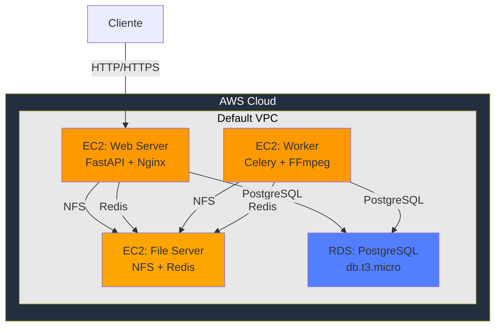
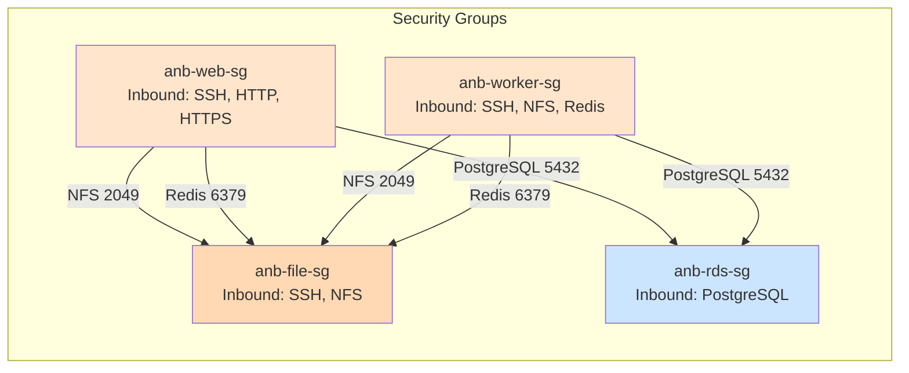
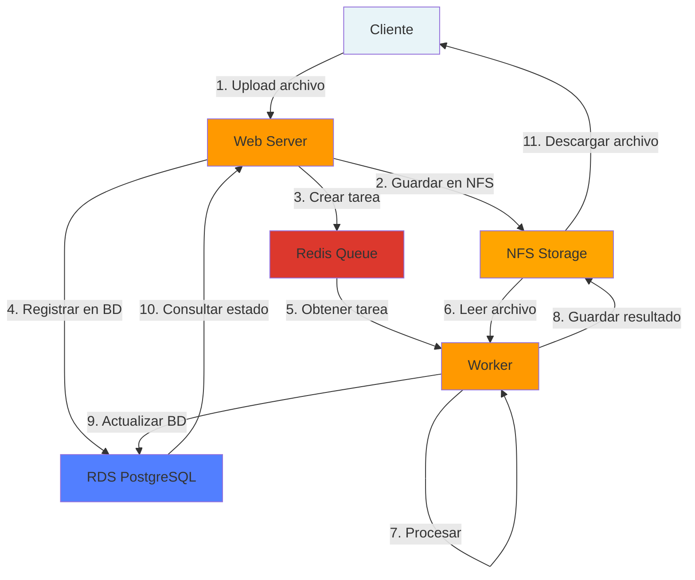

# Arquitectura de Despliegue en AWS - Entrega 2

## Descripción General

Este documento describe la arquitectura de la aplicación desplegada en Amazon Web Services (AWS) para la Entrega 2.

## Componentes Principales

### 1. Amazon EC2 - Web Server
- **Descripción**: Instancia de cómputo que ejecuta el servidor web de la aplicación
- **Especificaciones**: t3.small (2 vCPU, 2 GiB RAM, 50 GiB almacenamiento)
- **Software**: FastAPI + Nginx
- **Rol**: Exponer la API REST

### 2. Amazon EC2 - Worker
- **Descripción**: Instancia de cómputo que procesa tareas asincrónicas
- **Especificaciones**: t3.small (2 vCPU, 2 GiB RAM, 50 GiB almacenamiento)
- **Software**: Celery + FFmpeg
- **Rol**: Procesar archivos de forma asincrónica

### 3. Amazon EC2 - File Server
- **Descripción**: Instancia de cómputo con almacenamiento compartido
- **Especificaciones**: t3.small (2 vCPU, 2 GiB RAM, 50 GiB almacenamiento)
- **Software**: NFS Server, Redis, PostgreSQL (temporal)
- **Rol**: Almacenar archivos compartidos y gestionar cola de tareas

### 4. Amazon RDS - PostgreSQL
- **Descripción**: Base de datos relacional administrada
- **Especificaciones**: db.t3.micro (100 GiB almacenamiento)
- **Rol**: Persistencia de datos de la aplicación

## Cambios Respecto a Entrega 1

- Migración de entorno local a AWS
- Separación de componentes en instancias EC2 independientes
- Implementación de NFS para almacenamiento compartido
- Uso de RDS para base de datos administrada

## Diagrama de Despliegue

## Configuración de Seguridad

### Security Groups

## Flujo de Datos

