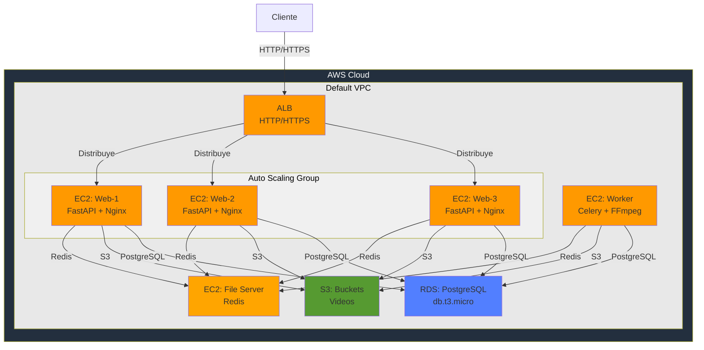

# ENTREGA 3 - ARQUITECTURA DE ESCALABILIDAD EN LA CAPA WEB

## Cambios Principales

1. **Load Balancer (ALB)**: Distribución de tráfico entre instancias web
2. **Auto Scaling Group**: 1-3 instancias web según demanda
3. **Amazon S3**: Reemplaza NFS para almacenamiento de videos
4. **CloudWatch**: Monitoreo y alarmas de escalado

## Modelo de Despliegue

## Componentes

| Componente | Especificación |
|-----------|----------------|
| **ALB** | HTTP/HTTPS, health check 30s |
| **Web (ASG)** | t3.small, 1-3 instancias, FastAPI + Nginx |
| **File Server** | t3.small, Redis |
| **RDS** | PostgreSQL db.t3.micro, 100 GB |
| **S3** | Buckets `/original/` y `/processed/` |
| **Worker** | t3.small, Celery + FFmpeg |
| **CloudWatch** | Métricas, logs, alarmas |

## Auto Scaling

| Acción | Métrica | Límite |
|--------|---------|--------|
| Scale Out | CPU > 70% (2 min) | Máx 3 instancias |
| Scale In | CPU < 30% (5 min) | Mín 1 instancia |

## Seguridad

| SG | Puertos | Origen |
|----|---------|--------|
| ALB | 80, 443 | Internet |
| Web | 80, 443 | ALB |
| File Server | 6379 | Web, Worker |
| RDS | 5432 | Web, Worker |
| Worker | Interno | VPC |

**IAM**: LabRole con permisos S3, RDS, CloudWatch

## Límites AWS Academy

- Máx 9 instancias EC2
- Máx 32 vCPUs
- Máx 100 GB EBS
