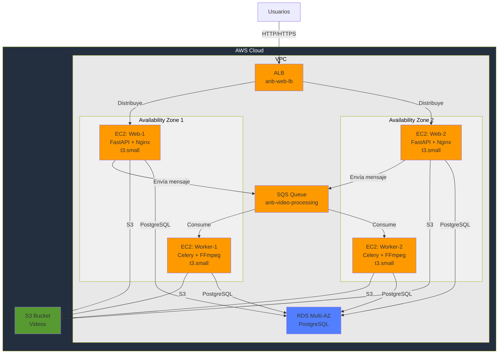

# ENTREGA 4 - ARQUITECTURA DE ESCALABILIDAD EN LA CAPA BATCH/WORKER

## Cambios Principales respecto a Entrega 3

| Cambio | Entrega 3 | Entrega 4 |
|--------|-----------|----------|
| **Comunicación web-worker** | Redis | SQS |
| **Workers** | 1 fijo | 1-3 elástico |
| **Almacenamiento** | S3 | S3 únicamente |
| **Alta disponibilidad** | Parcial | Multi-AZ completo |
| **Monitoreo** | CloudWatch básico | CloudWatch + SQS |

---

## Modelo de Despliegue - Entrega 4



---

## Componentes - Entrega 4

| Componente | Especificación | Cambio |
|-----------|----------------|--------|
| **ALB** | HTTP/HTTPS, health check 30s | Sin cambios |
| **Web (ASG)** | t3.small, 1-3, Multi-AZ | Distribuido en 2 AZs |
| **SQS** | Standard Queue, 1800s timeout | **NUEVO** |
| **Worker (ASG)** | t3.small, 1-3, Multi-AZ | **NUEVO** |
| **RDS** | PostgreSQL db.t3.micro, Multi-AZ | Multi-AZ habilitado |
| **S3** | `/original/` y `/processed/` | Sin cambios |
| **CloudWatch** | Métricas, logs, alarmas | Monitoreo de SQS |

---

## Auto Scaling - Entrega 4

### Capa Web
| Acción | Métrica | Límite |
|--------|---------|--------|
| Scale Out | CPU > 70% (2 min) | Máx 3 instancias |
| Scale In | CPU < 30% (5 min) | Mín 1 instancia |

### Capa Worker (NUEVO)
| Acción | Métrica | Límite |
|--------|---------|--------|
| Scale Out | SQS depth > 2 msgs/worker | Máx 3 instancias |
| Scale In | SQS depth < 1 msg/worker | Mín 1 instancia |
| Cooldown | 300s scale-out, 600s scale-in | - |

---

## Flujo de Procesamiento - Entrega 4

```
1. Usuario sube video por API
   ↓
2. Web Server (ALB distribuye)
   ├─ Valida video
   ├─ Guarda en S3 (/original/)
   └─ Envía mensaje a SQS
   ↓
3. SQS Queue
   └─ Almacena mensaje
   ↓
4. CloudWatch detecta profundidad SQS
   └─ Dispara escalamiento si es necesario
   ↓
5. Worker (1-3 instancias)
   ├─ Consume mensaje de SQS
   ├─ Descarga video de S3
   ├─ Procesa con FFmpeg
   ├─ Guarda en S3 (/processed/)
   └─ Actualiza BD
   ↓
6. Usuario descarga video procesado
```

---

## Seguridad - Entrega 4

| SG | Puertos | Origen | Cambio |
|----|---------|--------|--------|
| ALB | 80, 443 | Internet | Sin cambios |
| Web | 80, 443 | ALB | Sin cambios |
| Worker | Interno | VPC | **NUEVO** |
| RDS | 5432 | Web, Worker | Sin cambios |

**IAM**: LabRole con permisos S3, RDS, SQS, CloudWatch, EC2

---

## Cambios de Configuración Requeridos

### 1. API REST (Web)
- Cambiar: Enviar mensaje a SQS en lugar de Redis
- Guardar video en S3 antes de encolar
- Usar boto3 para SQS

### 2. Worker (Celery)
- Cambiar: Consumir mensajes de SQS en lugar de Redis
- Descargar video de S3
- Procesar con FFmpeg
- Guardar resultado en S3

### 3. CloudWatch Monitoring
- Métrica: `AWS/SQS:ApproximateNumberOfMessagesVisible`
- Alarma: Mensajes > 5
- Dashboard: SQS + EC2 + ALB
